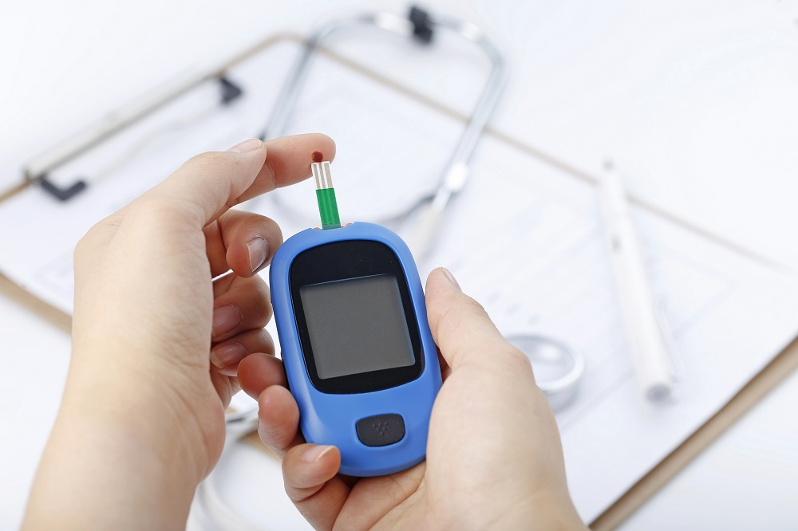
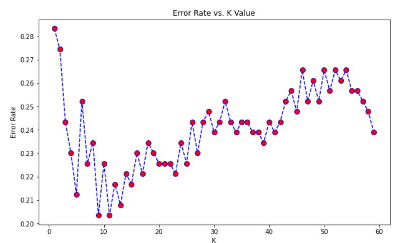
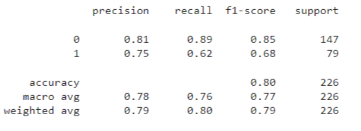

# Detecting Diabetes - KNN

## K Nearest Neighbors(KNN)


K-Nearest Neighbors is one of the simplest Machine Learning algorithms based on **Supervised Learning** technique.
K-NN algorithm assumes the similarity between the new case/data and available cases and put the new case into the category that is most similar to the available categories. K-NN algorithm stores all the available data and classifies a new data point based on the similarity. This means when new data appears then it can be easily classified into a well suite category by using K- NN algorithm.
K-NN algorithm can be used for Regression as well as for Classification but mostly it is used for the Classification problems.

You can find a more formal definition on [Wikipedia](https://en.wikipedia.org/wiki/K-nearest_neighbors_algorithm).


## About Dataset - 

### Dataset Description
TThis dataset is originally from the National Institute of Diabetes and Digestive and Kidney Diseases. The objective of the dataset is to diagnostically predict whether or not a patient has diabetes, based on certain diagnostic measurements included in the dataset. Several constraints were placed on the selection of these instances from a larger database. In particular, all patients here are females at least 21 years old of Pima Indian heritage.


The datasets consists of several medical predictor variables and one target variable, Outcome. Predictor variables includes the number of pregnancies the patient has had, their BMI, insulin level, age, and so on.

You can access or download the dataset from [here](https://github.com/Deeshu-Jain/Detecting-Diabetes-Using-KNN/blob/main/diabetes.csv) or from [Kaggle]{https://www.kaggle.com/datasets/uciml/pima-indians-diabetes-database?datasetId=228&sortBy=voteCount}.


## Content
**Detecting Diabetes - KNN** 



In this project, we are working with Pima Indians Diabetes Database. Exploratory Data Analysis is performed on the dataset. Then a knn machine learning model is build to accurately predict whether or not the patients in the dataset have diabetes or not.


## Instructions for Running Python Notebooks Locally
 
 - Install the required libraries in your Virtual Environment.

 - Run notebooks as usual by using a jupyter notebook server, Vscode etc.


## Libraries to Install
    
:white_check_mark: **Numpy** : [Numpy Installation](https://numpy.org/install/)

:white_check_mark: **Pandas** : [Pandas Installation](https://pandas.pydata.org/docs/getting_started/index.html)

:white_check_mark: **Pandas-Profiling** : [Pandas-Profiling Installation](https://pypi.org/project/pandas-profiling/)

:white_check_mark: **Matplotlib** : [Matplotlib Installation](https://matplotlib.org/stable/users/getting_started/)

:white_check_mark: **Seaborn** : [Seaborn Installation](https://seaborn.pydata.org/installing.html)

:white_check_mark: **Scikit-learn** : [Sklearn Installation](https://scikit-learn.org/stable/install.html#)


## Project Notebook

You can install Jupyter Notebook Environment from [here](https://jupyter.org/install) or through the [Anaconda Distribution](https://www.anaconda.com/products/distribution) or, can even use any IDE you like.

You can access the **Project Notebook** from [here](https://github.com/Deeshu-Jain/Detecting-Diabetes-Using-KNN/blob/main/Detection%20of%20Diabetes.ipynb).


## Code Snippet

```python
plt.figure(figsize=(10,6))
plt.plot(range(1,60),error_rate,color='blue', linestyle='dashed', marker='o',
         markerfacecolor='red', markersize=8)
plt.title('Error Rate vs. K Value')
plt.xlabel('K')
plt.ylabel('Error Rate')
```


## Screenshots
Includes Screenshots of Some Visualization Figures, Classification Report







## Support My Work :wink:
You can feel free to comment on my projects, find the bugs :mag_right: or tell me what your thoughts about my coding, analysis and insight. You can also take some codes away if you think some of them can be useful for your projects :computer:. 
If you liked what you saw :blush:, want to have a chat with me about the portfolio, work opportunities, or collaboration, shoot :gun: an email at djjain844@gmail.com.

You can check out my portfolio here :v:.
